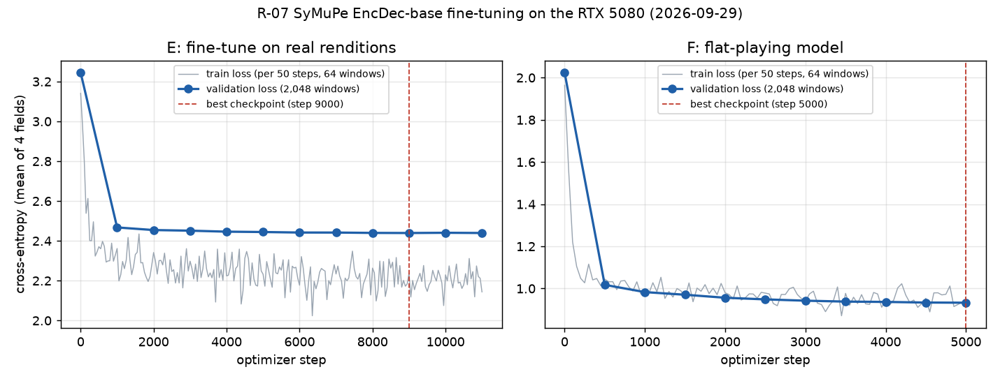

# R-07 report: fine-tuning SyMuPe (and Pianist Transformer) on piece-disjoint PianoCoRe

Written 2026-09-29, about 22:10 UTC (17:10 local), while the job was still running. This is a readable companion to `README.md`, which holds the pre-registration and the lead's run record. **Audited 2026-10-05 by `eval-auditor`: Confirmed with caveats** (details in README `## Audit`; the key caveats are summarised in the "Audit verdict" section at the end). Every number cites the file it came from, and paths are relative to this folder unless they start with `C:\`. Section 4b (added later) has the first evaluation results, for set P; they are provisional and not audited.

---

## 1. What R-07 is and why

### The problem it follows from

R-06 compared two pretrained, frozen expressive-performance models on PercePiano passages that neither model had seen. SyMuPe EncDec-base and Pianist Transformer tied on per-note prediction (composite r 0.388 vs 0.393, from `EXPERIMENTS.md`, R-06 row). The R-06 audit also found a serious flaw: a model's likelihood ranks every *deadpan* (flat, mechanical) rendition above the real expert one (AUC 0.00). So "how probable does the model find this performance?" cannot serve as a quality or typicality score as it stands (DECISIONS 2026-09-28).

R-07 asks whether fine-tuning fixes the first problem, and whether a corrected score fixes the second.

### The questions (README "Question")

1. **Per-note prediction.** Does fine-tuning SyMuPe EncDec-base on PianoCoRe tier A plus (n)ASAP, with whole works held out, predict the per-note expression of unseen pieces better than the frozen model did in R-06?
2. **H1b preview.** How much of the *shared* expert variation (the R-02 audit method) does the variation between the fine-tuned model's samples cover, on pieces that neither pretraining nor fine-tuning saw? (R-10 owns the real H1b verdict.)
3. **Corrected typicality.** Can a corrected score rank real expert performances above every deadpan variant from the R-06 audit? The three candidates are a likelihood ratio against a flat-playing model, a typical-set distance, and deviation-only agreement. A score may be used anywhere only if it passes.
4. **Secondary arm.** The same fine-tune for Pianist Transformer, for questions 1 and 2.
5. **Cost** on the 16 GB RTX 5080.

### Decision rules (fixed before any results)

The primary evaluation set is **P**: PercePiano segments of Beethoven WoO 80 and Schubert D960 mv2 / mv3, with 981 human renditions in 86 passages, unseen by SyMuPe pretraining and held out here.

| Question | Statistic | Reading |
|---|---|---|
| (a) per-note prediction | Paired difference, fine-tuned E minus frozen, in the per-rendition composite r (the mean over velocity, log IOI ratio and log articulation of the Pearson r against the mean of K = 8 samples). 95% CI from a two-way passage x performer cluster bootstrap (2,000 resamples, seed 0), plus a t-interval over the 3 works. | **improves** if the whole CI is above 0; **harms** if the whole CI is below 0; otherwise **no detectable change**. |
| (a) reproduction gate | The frozen model re-run through this pipeline must give a P composite within 0.01 of R-06's 0.388. | If it misses, that is the first finding, and the comparison uses the re-run numbers. |
| (a) use downstream | E replaces the frozen model in R-10 / tier D only if (a) on P reads "improves" or "no detectable change" **and** E's best validation loss is below the frozen model's (step 0). | Otherwise R-10 keeps the frozen model. |
| (b) H1b preview | On R10u pieces with at least 20 renditions: the median share of the expert variance in the k shared components that lies in the span of E's K = 16 sample deviations. It is compared with a random 15-dimensional subspace. | median at least 0.50: "consistent with H1b"; at most 0.20: "at the H1b falsification level"; otherwise inconclusive. The same thresholds apply to the mean-curve R²c, per target. |
| (c) typicality | Four scores: S-RAW (reference), S-LR = ℓ_E − ℓ_F, S-TYP (typical-set distance), S-DEV (shape-only agreement). Each gets a paired AUC against each variant in the deadpan / noise battery. | **pass** needs R1 (deadpan battery: AUC ≥ 0.75, CI above 0.5, ≥ 0.5 in each P work), R2 (still detects jitter) and R3 (replicates on Vienna). R1 + R3 without R2 means **flatness detector only**. Anything else is **fail**, and that score is used nowhere. |
| (d) cost | Seconds per step and peak memory from `calibrate`; wall time per stage. | Descriptive. |

Secondary sets (reported, not deciding): **R10u** (transcribed MIDI; [audit 2026-10-05] the evaluation set has 91 pieces: 75 of the 76 R-02 pieces unseen by pretraining and fine-tuning, plus 16 work-mates, 10 of which were seen paired in SyMuPe pretraining), **R10s** (held out here but seen in pretraining), **V** (Vienna 4x22), **A** ((n)ASAP, Pianist Transformer's test folders).

### The split (README "Splits", `split/summary.json`)

The unit of the split is the **work**: all movements of a sonata, or a prelude with its fugue, go to one side. Test: 257 piece ids in 129 works. Validation: 91 piece ids in 59 works, used only for early stopping. Quarantine: 81 piece ids that might alias a test piece. Train: everything else. The split is committed in `split/pieces.csv`.

---

## 2. The models

### SyMuPe EncDec-base (arms "frozen", "E" and "F")

Sources: `C:\Users\Vuduc\r07\models\EncDec-base\config.json`, `tokenizer.json`, `README.md` (model card), and a CPU parameter count run for this report.

- **Origin.** Borovik et al., *SyMuPe*, ACM MM 2025. HF `SyMuPe/EncDec-base` at revision `1b942f28`; code `symupe` at commit `13cc57d`. The model card says it was pretrained for 300,000 iterations on PERiScoPe v1.0. License CC BY-NC-SA 4.0.
- **Type.** `Seq2SeqMusicTransformer`, a Transformer encoder-decoder. The model card gives the objective as causal language modelling over performance tokens.
- **Size.** 25,106,586 parameters (`job/outputs/symupe_E/run_meta.json`, `n_params`):
  - encoder 12,099,680, of which the token embeddings are 296,544;
  - decoder 13,303,450, including its embeddings and output heads.
- **Transformer blocks** (same in the encoder and the decoder):
  - model width 512, depth 4;
  - 8 heads of dimension 64, with one shared key/value head (multi-query);
  - rotary position embeddings (base 1024) and no absolute positions;
  - GLU-Swish feed-forward, ×3 width;
  - dropout 0.1, and 4 memory tokens.
- **One position per note.** A note is a compound token with several fields. Each field gets a 64-dimensional embedding, and the field embeddings are concatenated. The embeddings are continuous-valued (sinusoidal, learned frequencies; `"discrete": false`), not lookup tables.
- **Fields** (`num_tokens` = vocabulary size per field):
  - **Score** (encoder side): `Pitch` 97, `Position` 202, `PositionShift` 142, `Duration` 142.
  - **Performance** (what the model predicts): `Velocity` 137, `TimeShift` 371, `TimeDuration` 319, `TimeDurationSustain` 319. `TimeDurationSustain` is the note's length with the sustain pedal applied. Its embedding is tied to `TimeDuration`.
  - The `TimeShift` bins run from −0.5 to 10.0, and the `TimeDuration` bins from 0 to 10.0, both on non-uniform grids that are finer near zero. The units are whatever the SyMuPe tokenizer defines; they were not checked for this report.
  - **Conditioning context** (decoder side): score-level `Velocity` (137) and `Tempo` (170) tokens, concatenated into the decoder input. The config also sets score-token dropout to 0.2. In this project each rendition's conditioning is one global tempo (60 / its seconds-per-quarter) and one velocity (its median velocity), exactly as in R-06.
- **Inputs and outputs in this job** (`job/symupe_train.py`):
  - The encoder gets the score plus the performance fields *masked*, built with the package's own `prepare_sequence`.
  - The decoder predicts the four performance fields note by note. The output is one categorical distribution per field.
  - The loss is the package's cross-entropy. The logged total equals the mean of the four field losses; this was checked against the step-0 validation values in `train_log.jsonl`.
- **Context window.** 256 notes, the paper's context. Training windows start at random. Validation windows are fixed, non-overlapping 256-note windows from the start of each validation item, up to 2,048 windows. SOS and EOS are added only when a window touches the true start or end of the piece.
- **Tokenization failures.** `encode_pair` (the R-06 adapter) refuses an item when the tokenizer's note order differs from our alignment order. That skipped 636 of 37,295 train items and 9 of 2,350 validation items (1.7%). The failures are listed in `job/outputs/tokens/tokenize_meta.json`. The pre-registration did not anticipate this rate; the run record discloses it.

### Pianist Transformer rendering (arms "pt_frozen" and "pt_E")

Sources: `C:\Users\Vuduc\r07\models\pianist-transformer-rendering\config.json`, `README.md` (model card), `C:\Users\Vuduc\r07\src\PianistTransformer\src\model\pianoformer.py`, `...\src\utils\midi.py`, and the R-06 adapter `../2026-09-27-R-06-expression-model-h2h/adapters/pt_adapter.py`.

- **Origin.** You et al., arXiv 2512.02652. HF `yhj137/pianist-transformer-rendering` at `8f156820`; code at `747df2d`. License Apache-2.0. The model card describes self-supervised pretraining on a 10-billion-token MIDI corpus followed by supervised fine-tuning (SFT) for rendering.
- **Type.** `PianoT5Gemma`, an asymmetric T5Gemma encoder-decoder.
- **Size.** 135,742,464 parameters (`job/outputs/pt_E/run_meta.json`). The model card says 135M.
- **Transformer blocks** (hidden size 768):
  - 8 query heads and 4 key/value heads (grouped-query attention), head dimension 128;
  - GELU-tanh feed-forward of width 3072;
  - RoPE (θ 10,000); attention logits soft-capped at 50 and final logits at 30.
- **Encoder.** 10 layers, alternating sliding-window (4,096) and full attention.
- **Decoder.** 2 layers.
- **Tokens: 8 per note**, from one vocabulary of 5,389 ids (`midi_to_ids`; `config.json` gives the id ranges):
  - pitch;
  - interval: the time since the previous note's onset, in ms;
  - velocity;
  - duration, in ms;
  - four sustain-pedal samples, taken at 0, ¼, ½ and ¾ of the way to the next onset.

  The id ranges:

  | Ids | Meaning |
  |---|---|
  | 0-4 | special: pad, mask, bos, eos, play |
  | 5-132 | pitch |
  | 133-260 | velocity |
  | 261 onward | timing (interval and duration) |
  | 5,261-5,388 | pedal |

  In the labels, the pedal samples are binarised at 64 (the authors' `sft.py` `group_ids`).
- **Sequence compression.** The encoder embeds the 8 tokens of each note, projects each one 768 → 96 with its own linear layer, and concatenates the results into one 768-dimensional vector per note. A 4,096-token window is therefore 512 encoder positions. The decoder generates all 4,096 tokens autoregressively, with cross-attention to the encoder.
- **Inputs and outputs in this job** (`job/pt_train.py`, R-06 `PTScorer.ids`):
  - The input is a score MIDI with one tempo and one velocity on every note (the same conditioning as SyMuPe).
  - The labels are the authors' SFT label format built from our alignment: notes in score order, sorted performed onsets assigned in that order, each note's own velocity and key-down duration, and the four pedal samples.
  - The loss is the model's own seq2seq cross-entropy over all 8 tokens of each note. That includes pitch, which is copied from the score. **The PT loss is therefore not comparable in size to SyMuPe's.**
- **Context window.** 512 notes = 4,096 tokens, the authors' maximum context. Validation uses up to 512 fixed windows (the `--max-val-windows` default). No item failed PT tokenization: 37,295 / 2,350 items, 0 failures (`job/outputs/tokens_pt/tokenize_meta.json`).

### Fine-tuning recipe (README "Method"; `job/run.sh`; `train_config.json` files)

| | E (primary) | F (flat model, for S-LR) | pt_E (secondary) |
|---|---|---|---|
| Start from | released EncDec-base | released EncDec-base | released PT SFT weights |
| Training targets | real renditions | one random *flat* rendition per training item | real renditions |
| Window | 256 notes | 256 notes | 512 notes (4,096 tokens) |
| Batch per optimizer step | 64 windows (32 × 2 accumulation) | 64 (32 × 2) | 32 (2 × 16) |
| Optimizer | AdamW, lr 1e-4, weight decay 0.01, clip 1.0 | same | same |
| Schedule | 500 warmup, cosine to 10% | 500 warmup, cosine to 10% | 200 warmup, cosine to 10% |
| Max steps | 30,000 | 5,000 | 8,000 |
| Validation every | 1,000 steps | 500 | 500 |
| Early stop | 5 evaluations without a 0.1% relative improvement | same | same |
| Precision | bf16 autocast | bf16 | bf16 |
| Seed | 20260928 | 20260928 | 20260928 |
| Model kept | `best.pt` (lowest validation loss; can be step 0) | same | same |

The flat renditions for F (README (c)):
- timing follows the score at the item's own conditioning tempo;
- velocity equals the conditioning velocity;
- durations are U(0.85, 1.0) × nominal;
- onset noise has s.d. U(0, 10 ms) and velocity noise s.d. U(0, 4);
- there is no pedal.

This family is deliberately narrower than the test battery.

How the early-stopping counter works (`job/trainlib.py`):
- an evaluation counts as "improved" only if it beats the best loss so far by at least 0.1%;
- `best.pt` is saved on any improvement, however small;
- the counter resets only on an improvement of at least 0.1%.

---

## 3. What was done, in order

The job was written for a Linux GPU box reached over SSH (`job/README.md`). It was actually run natively on Windows 11 on Henry's RTX 5080 machine, from Git Bash, with no WSL. The machine details are in the README run record:
- driver 616.56, 24 CPU threads, torch 2.7.1+cu128 in both venvs;
- the GPU was shared with the desktop, which used about 7 GB of VRAM.

Times are UTC, taken from `run.sh` stamps in the logs under `C:\Users\Vuduc\r07\logs\` and `job/outputs/logs/`. Local time is UTC−5.

| # | When (UTC) | Step | What happened | Fix |
|---|---|---|---|---|
| 1 | before 20:39 | `job/*.sh` | Git (`core.autocrlf=true`) checked the shell scripts out with CRLF endings, and the first text patches to them silently failed to match. | Converted to LF. Git still warns "LF will be replaced by CRLF" for these files. |
| 2 | before 20:39 | venv paths | The scripts called `$V/bin/python`. On Windows a uv venv keeps python in `Scripts\python.exe` (the first `setup.sh` run failed with "No virtual environment ... found for path `.../venv-symupe/bin/python`"), and Python needs native Windows paths. | Added helpers `vpy` (bin/ or Scripts/) and `wpwd` (`pwd -W`) to `setup.sh`, `run.sh` and `eval.sh` (`git diff`). `setup.sh` also now checks for the venv directory, not `bin/python`, and reinstalls pianolens every run (`--reinstall-package pianolens`). |
| 3 | ~20:39-20:40 | `setup.sh`, `setup.sh pt` | Both venvs built. Both report "cuda 12.8 available True", capability (12, 0), bf16 matmul ok. | - (`setup_symupe.log`, `setup_pt.log`) |
| 4 | to ~20:50 | `fetch_data.sh` | PianoCoRe metadata and refined zip downloaded, checksums OK; (n)ASAP at `4097b45` (`fetch.log`: 3.6 GB pianocore, 2.0 GB asap on disk). | - |
| 5 | ~20:52 | R-06 items | The P / V / A evaluation items existed only on the Mac (gitignored R-06 artifacts). | Rebuilt here with the unchanged R-06 `prepare.py` from PercePiano e672299, Vienna 4x22 1033ade and (n)ASAP 4097b45 (`r06_prepare.log`). The counts match the R-06 README (line 168-170): P 981 renditions in 86 passages (1 excluded for matched share), 103 external deadpans, A 80, V 88. |
| 6 | to ~20:57 | first `prep` + `tokenize` (**discarded**) | (i) `pianocore.py` `_midi_from_bytes` wrote each MIDI to a `NamedTemporaryFile` and reopened it by name while it was still open. Windows does not allow that, so every PianoCoRe load failed: prep recorded **47,732 `load_error`** rows, and only the 609 + 32 (n)ASAP items survived (`job/outputs/logs_failed_run1/prep.log`). (ii) Tokenize then crashed with `BrokenProcessPool`, because symupe imports the Unix-only `resource` module (`ModuleNotFoundError: No module named 'resource'`, `logs_failed_run1/tokenize.log`). | (i) The temp file is now closed before loading (`delete=False`) and deleted in a `finally` (`git diff src/pianolens/data/pianocore.py`). (ii) On Windows only, `setup.sh` installs a no-op `resource.py` stub into the SyMuPe venv. symupe uses it only to cap memory in its parangonar aligner, which this job never calls. The failed outputs were discarded and the logs kept. |
| 7 | to 21:14 | second `prep` + `tokenize` | prep: 784 s, 12 workers, leakage check OK. tokenize: 636 / 9 items skipped by the order guard (section 2). | - |
| 8 | (prep) | split hash | `prep_data.py` recorded the split sha256 as `d7ec539c...` (`job/outputs/data/leakage_report.json`), not the pre-registered `3341bfa5...86`. Cause: git checked `split/pieces.csv` out with CRLF endings. | None needed. The lead re-hashed it: with CR stripped it hashes to `3341bfa5...86`, the same as `git show HEAD:.../split/pieces.csv`. Same split, different line endings. |
| 9 | 21:15 | `calibrate` | 0.150 s per step, peak 2.77 GB, projected 1.25 h for 30,000 steps. No cloud GPU needed. | - |
| 10 | 21:15-21:47 | train E | No interruptions. Early stop at step 11,000; best at step 9,000 (section 4). | - |
| 11 | 21:15-21:21 | `tokenize_pt` | 0 failures. | - |
| 12 | from 21:21 | eval: frozen, pt_frozen | Started while E trained. These arms do not depend on E, and the rules were fixed beforehand (run record). | - |
| 13 | ~21:49-22:06 | `tokenize_flat`, train F | Same 636 / 9 skipped items as E. Ran to the 5,000-step cap. | - |
| 14 | 22:07 | `calibrate_pt` | 3.14 s per step, peak 8.32 GB, projected 6.98 h for 8,000 steps. Measured while the frozen evaluation shared the GPU, so it is an upper bound (run record). | - |
| 15 | from 22:08 | train pt_E; eval E, F | Running when this was written. | - |

The run record confirms that the changes are platform fixes only: the recipe, split, selection and decision rules did not change. The diff hash at launch is `c71b7d83be77...`. `git diff --stat` shows exactly these files: `job/eval.sh`, `job/run.sh`, `job/setup.sh`, `src/pianolens/data/pianocore.py`, and the README run record. `job/fetch_data.sh` appears as modified in `git status`, but only its line endings differ.

---

## 4. Results so far (training only; no evaluation results yet)

### Data (`job/outputs/data/prep_meta.json`, `leakage_report.json`)

Prep read 48,373 rows and produced **45,670 items**. It excluded 2,703 for a matched share below 0.8.

| Split | Source | Items | Pieces | Notes |
|---|---|---|---|---|
| train | PianoCoRe | 36,686 | 1,280 | 65,439,611 |
| train | (n)ASAP | 609 | 118 | 1,692,281 |
| val | PianoCoRe | 2,318 | 78 | 4,245,371 |
| val | (n)ASAP | 32 | 11 | 68,621 |
| test (R10u + R10s) | PianoCoRe | 6,025 | 139 | 10,612,725 |

Leakage report:
- `ok: true`; 37,295 training rows used on 1,285 training pieces;
- no unknown piece ids, no held-out pieces or works in train, no performance in two splits.

The tokenizers re-ran the same check (`tokenize_meta*.json`, `leakage.ok = true`).

Tokenization:

| Token set | Train items | Train failures | Val items | Val failures | Shards (train / val) |
|---|---|---|---|---|---|
| E (`tokens/tokenize_meta.json`) | 37,295 | 636 | 2,350 | 9 | 146 / 10 |
| F (`tokens_flat/tokenize_meta_flat.json`) | 37,295 | 636 | 2,350 | 9 | 146 / 10 |
| PT (`tokens_pt/tokenize_meta.json`) | 37,295 | 0 | 2,350 | 0 | 146 / 10 |

### Cost (question (d))

| Arm | Source | s / step (median) | Windows / step | Peak GPU memory | Projected at max steps |
|---|---|---|---|---|---|
| SyMuPe (E, F) | `job/outputs/calibrate/calibrate.json` | 0.150 (25 timed) | 64 × 256 notes | 2.77 GB | 1.25 h for 30,000 |
| Pianist Transformer | `job/outputs/calibrate_pt/calibrate.json` | 3.14 | 32 × 4,096 tokens | 8.32 GB | 6.98 h for 8,000 |

Actual wall time:
- **E** ran 21:15-21:47 UTC, about 32 min for 11,000 steps.
- **F** ran 21:49-22:06 UTC, about 17 min for 5,000 steps.

Summing the logged `sec_per_step` gives about 1,923 s for E and 988 s for F. Logged peak memory was 2.79 GB for both (`train_log.jsonl`, `max_mem_gb`). Both fit easily in 16 GB without the fallbacks, and no cloud GPU was needed.

### Training curves

`figures/train_curves_E_F.png`. The grey line is the training loss logged every 50 steps, on 64 random windows from *training* pieces. The blue line is the validation loss on 2,048 fixed windows of the validation pieces. The dashed line marks the best checkpoint.

**E: validation loss by evaluation** (`job/outputs/symupe_E/train_log.jsonl`, `"event": "val"` lines). Losses are cross-entropy in nats; the total is the mean of the four fields.

| Step | Val loss | Velocity | TimeShift | TimeDuration | TimeDurationSustain | best so far | bad evals |
|---|---|---|---|---|---|---|---|
| 0 (pretrained) | 3.2450 | 3.1676 | 2.6837 | 3.5938 | 3.5347 | 3.2450 | 0 |
| 1,000 | 2.4675 | 1.8216 | 1.9572 | 3.0559 | 3.0353 | 2.4675 | 0 |
| 2,000 | 2.4544 | 1.8146 | 1.9485 | 3.0367 | 3.0178 | 2.4544 | 0 |
| 3,000 | 2.4512 | 1.8112 | 1.9442 | 3.0340 | 3.0154 | 2.4512 | 0 |
| 4,000 | 2.4462 | 1.8069 | 1.9413 | 3.0277 | 3.0091 | 2.4462 | 0 |
| 5,000 | 2.4445 | 1.8060 | 1.9372 | 3.0259 | 3.0088 | 2.4445 | 1 |
| 6,000 | 2.4419 | 1.8047 | 1.9336 | 3.0233 | 3.0060 | 2.4419 | 0 |
| 7,000 | 2.4418 | 1.8044 | 1.9328 | 3.0236 | 3.0063 | 2.4418 | 1 |
| 8,000 | 2.4400 | 1.8043 | 1.9310 | 3.0209 | 3.0039 | 2.4400 | 2 |
| **9,000** | **2.4395** | 1.8024 | 1.9299 | 3.0212 | 3.0045 | **2.4395** | 3 |
| 10,000 | 2.4407 | 1.8042 | 1.9313 | 3.0222 | 3.0049 | 2.4395 | 4 |
| 11,000 | 2.4396 | 1.8035 | 1.9297 | 3.0214 | 3.0038 | 2.4395 | 5 → stop |

- Final state (`job/outputs/logs/train.log`): step 11,000, `stopped_early: true`, best 2.43952. `best.pt` holds the **step-9,000** weights.
- Almost all of the gain comes in the first 1,000 steps: 3.2450 → 2.4675. Steps 1,000 to 9,000 add only 0.028. By field, the largest drop from step 0 is in Velocity (3.168 → 1.802). Why has not been investigated, and this report draws no conclusion from it.
- The training loss (about 2.1-2.4 after warmup) stays below the validation loss throughout. The two use different window sampling (random starts vs windows from the start of each item) and different pieces, so the gap is not a clean measure of overfitting.
- **"Minimum for use downstream", validation-loss half:** the best validation loss (2.4395) is below step 0 (3.2450), so this condition **holds** (the run record says the same). The other half, the reading of (a) on P, is still pending.
- Data exposure, derived from the numbers above: 11,000 steps × 64 windows × at most 256 notes is at most about 180 M note positions, about 2.7 passes over the 67.1 M training notes. The pre-registered cap allowed about 7 passes. This is an upper bound, because windows on short items hold fewer than 256 notes.

**F: validation loss by evaluation** (`job/outputs/symupe_F/train_log.jsonl`). The validation data are flat renditions of the validation items.

| Step | Val loss | Velocity | TimeShift | TimeDuration | TimeDurationSustain | bad evals |
|---|---|---|---|---|---|---|
| 0 (pretrained) | 2.0242 | 2.4371 | 2.0250 | 1.8258 | 1.8088 | 0 |
| 500 | 1.0176 | 2.0071 | 1.7890 | 0.1419 | 0.1324 | 0 |
| 1,000 | 0.9830 | 2.0083 | 1.7500 | 0.0915 | 0.0824 | 0 |
| 1,500 | 0.9706 | 1.9966 | 1.7390 | 0.0773 | 0.0693 | 0 |
| 2,000 | 0.9563 | 1.9814 | 1.7119 | 0.0688 | 0.0632 | 0 |
| 2,500 | 0.9485 | 1.9783 | 1.7040 | 0.0584 | 0.0533 | 0 |
| 3,000 | 0.9423 | 1.9761 | 1.6918 | 0.0528 | 0.0485 | 0 |
| 3,500 | 0.9380 | 1.9731 | 1.6855 | 0.0489 | 0.0447 | 0 |
| 4,000 | 0.9365 | 1.9729 | 1.6807 | 0.0483 | 0.0440 | 0 |
| 4,500 | 0.9336 | 1.9714 | 1.6762 | 0.0453 | 0.0413 | 0 |
| **5,000** | **0.9327** | 1.9712 | 1.6748 | 0.0443 | 0.0406 | 1 |

- Final state (`job/outputs/logs/train_flat.log`): step 5,000 (the cap), `stopped_early: false`, so `best.pt` is step 5,000.
- F learns the flat durations almost exactly: the TimeDuration loss is about 0.04. Velocity and TimeShift stay around 1.97 and 1.67, which fits the injected velocity and onset noise. This is only a description; F's job is to supply ℓ_F for S-LR.
- F's and E's losses are on different validation data (flat vs real), so they cannot be compared with each other.

**pt_E** (`job/outputs/pt_E/train_log.jsonl`, `C:\Users\Vuduc\r07\logs\train_pt.log`): started 22:08:28 UTC. The step-0 (released SFT weights) validation loss is **1.6420** on 512 windows. Only step 1 had been logged when this report was written. That loss covers all 8 tokens per note (see section 2), so it is not comparable with SyMuPe's.

---

## 4b. First evaluation results: set P (provisional, not audited)

Added 2026-09-30, about 01:10 UTC, from `job/outputs/results/P/summary.json`, `pass_fail.json` and
`auc.csv`. The arms in this summary are frozen, E, F and pt_frozen (pt_E is not trained yet). These
numbers are read with the pre-registered rules only, and **nothing here is Confirmed until
`eval-auditor` signs it off**.

### Reproduction gate: missed by 0.001

| Arm | P composite, this run [95% CI] | R-06 | Difference |
|---|---|---|---|
| frozen SyMuPe | 0.3987 [0.3647, 0.4314] | 0.388 | +0.011 (the gate is 0.01) |
| frozen Pianist Transformer | 0.3948 [0.3637, 0.4264] | 0.393 | +0.002 |

The frozen SyMuPe re-run misses the gate by 0.001. Under the pre-registered rule this is the first
finding, and (a) uses the re-run frozen numbers, with R-06's shown alongside. Known differences
from R-06: GPU instead of CPU sampling, and evaluation items rebuilt on this machine (same counts).
The Pianist Transformer re-run reproduces within the gate.

### (a) Per-note prediction on P: **harms**

| | Composite [bootstrap 95% CI] | Velocity | log IOI | log articulation |
|---|---|---|---|---|
| frozen | 0.3987 [0.3647, 0.4314] | 0.515 | 0.330 | 0.351 |
| E (fine-tuned) | 0.3478 [0.3113, 0.3845] | 0.541 | 0.267 | 0.235 |
| **E − frozen** | **−0.0509 [−0.0720, −0.0287]** | +0.027 [−0.001, 0.056] | −0.063 [−0.102, −0.026] | −0.116 [−0.152, −0.082] |

- The whole bootstrap CI of the paired composite difference is below 0, so the pre-registered
  reading is **harms**. The t-interval over the 3 works, [−0.178, 0.076], is reported alongside as
  the rules require; the reading uses the bootstrap CI.
- Per work (E − frozen): Beethoven WoO 80 −0.045, Schubert D960 mv2 −0.105, D960 mv3 −0.003.
- By target: velocity shows no detectable change; timing (log IOI) and articulation both get worse.
- **Consequence (pre-registered): E is not used downstream. R-10 uses the frozen model.** The
  validation-loss half of the condition held, but the P half fails.
- Secondary, pt_frozen − frozen: −0.004 [−0.028, 0.018] (the R-06 tie, reproduced).

### (c) Typicality scores, E on P

Paired AUC = the share of real renditions scoring above their own variant (from `auc.csv`, all works).

| Score | Deadpan battery (R1), AUC range | Noise (R2): jitT20 / jitT40 / jitV8 / jitV16 | R1 | R2 |
|---|---|---|---|---|
| S-RAW (reference) | 0.013-0.213 | 1.00 / 1.00 / 1.00 / 1.00 | fail | pass |
| **S-LR** | **1.000 on all 7** | 0.946 / 0.949 / 0.927 / 0.916 | **pass** | **pass** |
| S-TYP | 0.236 (half_flat_velocity) to 0.956 | 0.994 / 1.00 / 0.998 / 1.00 | fail | pass |
| S-DEV | 0.852-0.990 | 0.660 / 0.678 / 0.910 / 0.961 | pass | fail (timing-jitter AUC below 0.75) |
| B-amount (baseline) | 1.000 on all 7 | 0.118 / 0.046 / 0.003 / 0.000 | pass | fail |
| B-smooth (baseline) | - | - | fail | pass |

- **S-LR** meets R1 and R2 on P. The pass verdict also needs R3 (point AUC at least 0.75 for every
  R1 variant on Vienna, set V), which is still running. Until then S-LR is "R1 and R2 met on P".
- **Flag for the audit:** S-LR separates every deadpan variant perfectly (AUC 1.000, CI [1.0, 1.0]).
  F was trained only on flat renditions, so a very high ℓ_F on anything flat is expected by design,
  but a perfect score on every variant, including the half-flat ones outside F's training family,
  needs checking before it is trusted (for example, how far apart the score distributions are, and
  whether one field dominates).
- **S-DEV** separates deadpans but misses timing jitter, the same pattern as the trivial B-amount
  baseline. If R3 holds it would be a "flatness detector only".
- **S-TYP** fails R1 (half_flat_velocity AUC 0.236). **S-RAW** fails R1 again, as in R-06.
- F−frozen shows NaN in (a) because F is scored but not sampled (by design: F exists only for S-LR).

### Set V (Vienna 4x22), added about 02:00 UTC (`job/outputs/results/V/`)

**R3 (replication on V: point AUC at least 0.75 for every R1 variant), E:**

| Score | deadpan | vel+12 | vel−12 | slow15 | noise10_4 | half_flat_timing | half_flat_velocity | R3 |
|---|---|---|---|---|---|---|---|---|
| S-LR | 1.000 | 1.000 | 1.000 | 1.000 | 1.000 | 1.000 | 1.000 | met |
| S-DEV | 1.000 | 1.000 | 1.000 | 1.000 | 1.000 | 1.000 | 1.000 | met |
| S-TYP | 0.977 | 0.943 | 0.977 | 0.977 | 0.989 | 1.000 | 0.239 | not met |

**Typicality readings, pre-registered (R1 and R2 on P, R3 on V), provisional:**

| Score | R1 (P) | R2 (P) | R3 (V) | Reading |
|---|---|---|---|---|
| **S-LR** | met | met | met | **pass** |
| S-DEV | met | not met | met | **flatness detector only** (may feed only the F-06 "too flat" flag) |
| S-TYP | not met | met | not met | **fail** (used nowhere) |
| S-RAW (reference) | not met | met | not met | fail, as in R-06 |

The audit flag on S-LR stands and grows: it separates every deadpan variant perfectly on both P and
V. That is what a working likelihood-ratio score should do against flat playing, but perfection on
every variant (including ones outside F's training family) must be checked before S-LR is used.

**(a) on V (secondary, not deciding):** frozen 0.644, E 0.546, E − frozen **−0.098 [−0.135,
−0.063]** (whole CI below 0; every one of the 4 excerpts lower: −0.154, −0.113, −0.050, −0.076).
pt_frozen − frozen −0.088 [−0.174, −0.002]. So E also predicts worse than the frozen model on
Vienna, consistent with P.

### Set A ((n)ASAP, 80 renditions, 16 works), added about 03:00 UTC (`job/outputs/results/A/`)

Secondary, not deciding. (a): frozen 0.591, E 0.497, **E − frozen −0.094 [−0.145, −0.053]**
(whole CI below 0, the same direction as P and V); pt_frozen 0.429, pt_frozen − frozen −0.162
[−0.229, −0.100]. S-LR (E) again scores AUC 1.000 against every R1 deadpan variant.

### Secondary arm: fine-tuned Pianist Transformer (pt_E), added about 12:30 UTC 2026-10-01

Training ran to the 8,000-step cap (best validation loss 0.9762 at step 8,000, from 1.6420 at step
0). Evaluated on P, V and A; the summaries in `results/{P,V,A}/` now include all five arms.

The pre-registered secondary comparison is pt_E against pt_frozen. `summarize_eval.py` computes
differences only against the frozen SyMuPe arm, so pt_E − pt_frozen was computed afterwards with
the script's own `boot_ci` (two-way passage x performer bootstrap, 2,000 resamples, seed 0) and
`t_interval`, from the same `a_per_rendition.csv` (`results/pt_E_vs_pt_frozen.json`). No other
statistic was added.

| Set | pt_frozen | pt_E | **pt_E − pt_frozen [95% CI]** | Reading |
|---|---|---|---|---|
| P | 0.3948 | 0.4076 | **+0.013 [−0.013, +0.039]** (t-interval [−0.086, +0.111]) | no detectable change |
| V | 0.5562 | 0.4843 | −0.072 [−0.240, +0.095] | no detectable change |
| A | 0.429 | 0.460 | +0.031 [+0.001, +0.064] | improves (CI just above 0) |

- P per work: Beethoven WoO 80 −0.003, D960 mv2 −0.016, D960 mv3 +0.058.
- V per excerpt: Chopin Op. 10/3 +0.100, Op. 38 +0.088, Mozart K. 331 −0.383, Schubert D783 −0.092.
  The wide CI comes from the Mozart drop.
- So fine-tuning Pianist Transformer does not show the clear loss that fine-tuning SyMuPe shows
  (E − frozen: "harms" on P). Among P, V and A, the only set with a detectable change is A,
  Pianist Transformer's own shipped test folders, and that CI only just clears 0. P and V are not
  decided. [audit 2026-10-05: written before R10u / R10s; both later show an improvement, below.]
- For reference, against frozen SyMuPe on P: pt_E 0.4076 vs frozen 0.3987.

### Set R10u: (b) H1b preview and secondary (a), added 2026-10-04 00:20 UTC (`results/R10u/`)

R10u = PianoCoRe pieces held out from fine-tuning, mostly unseen by pretraining (transcribed MIDI;
[audit 2026-10-05] 91 pieces: 75 of the 76 pre-registered "unseen" R-02 pieces, 3 R-02 work-mates
and 7 other work-mates that are paired in PERiScoPe, and 6 unpaired work-mates; the unseen-only
subset gives the same readings, see README "Audit"). Arms in this
summary: frozen, E, F, pt_frozen. **pt_E is missing:** all 91 of its generation items failed with
"CUDA error: out of memory" while a game held about 5 GB of VRAM (`eval/pt_E/R10u/gen/_log_gen.json`).
Failed items are not written, so a rerun retries exactly those 91.

**(b) H1b preview (pre-registered thresholds: captured share ≥ 0.50 "consistent with H1b",
≤ 0.20 "at the H1b falsification level", otherwise inconclusive; same thresholds for R²c):**

| Arm | Median captured share (k shared components) | Random 15-dim subspace (mean / 95th pct) | Mean-curve R²c velocity | R²c log IOI |
|---|---|---|---|---|
| **E** | **0.098** | 0.012 / 0.015 | 0.413 | 0.065 |
| frozen | 0.118 | 0.012 / 0.015 | 0.325 | 0.142 |
| pt_frozen | 0.101 | 0.012 / 0.015 | 0.251 | −0.024 |

Median k = 6 shared components; split-half reliability 0.98 for both targets.

- **Reading for E (pre-registered): captured share 0.098 ≤ 0.20 → "at the H1b falsification
  level".** R²c velocity 0.413 → inconclusive; R²c log IOI 0.065 → at the falsification level.
- The spread of E's 16 samples covers about 10% of the variance experts share, well above a random
  subspace (about 8×) but far below the 0.50 bar. The frozen model reads the same; fine-tuning did
  not change it.
- This is a preview. R-10 owns the H1b verdict.

**(a) on R10u (secondary, not deciding):** E − frozen **+0.041 [+0.028, +0.051]** = "improves"
(the opposite of P, V and A, where E harms). R10u is transcribed PianoCoRe MIDI, the same kind of
data E was fine-tuned on, while P, V and A are sensor/Disklavier recordings. One possible reading
(not tested here): fine-tuning adapted the model to transcription characteristics rather than to
expert expression. pt_frozen − frozen −0.048 [−0.062, −0.039].

**R10u update, 2026-10-05 08:29 UTC: pt_E added.** The 91 failed generation items were retried
with the GPU free: 91 of 91 succeeded, 0 errors. The R10u summary now has all five arms. The E
and frozen numbers above are unchanged.

| Arm | Captured share | R²c velocity | R²c log IOI |
|---|---|---|---|
| pt_E | 0.124 | 0.492 | 0.260 |

- pt_E's captured share, 0.124, is also at the falsification level (≤ 0.20). Both R²c values are
  inconclusive (between 0.20 and 0.50; velocity just under 0.50).
- (a) pt_E − pt_frozen on R10u: **+0.100 [+0.089, +0.114]**, improves (velocity +0.048, timing
  +0.109, articulation +0.145; `results/pt_E_vs_pt_frozen_R10u.json`). pt_E − frozen SyMuPe
  +0.052 [+0.037, +0.064].

### Set R10s, added 2026-10-05 04:25 UTC (`results/R10s/`, all five arms)

R10s = held out here but **seen paired in SyMuPe's pretraining** (24 works, 1,812 renditions).
It is the pre-registered exposure contrast for R-10, not a decision set.

**H1b-style measures on R10s** (same method as R10u; median k = 6; random 15-dim subspace
0.008 / p95 0.010):

| Arm | Captured share | R²c velocity | R²c log IOI |
|---|---|---|---|
| E | 0.086 | 0.523 | −0.094 |
| frozen | 0.110 | 0.477 | 0.223 |
| pt_frozen | 0.103 | 0.325 | −0.237 |
| pt_E | 0.107 | 0.472 | 0.181 |

The captured share is about 0.09-0.11 for every arm, the same level as on R10u (0.098-0.124 with pt_E; [audit 2026-10-05] was "0.098-0.118").
Exposure in pretraining does not lift it. E's velocity mean-curve R²c reaches 0.52 here
(0.41 on R10u), while its timing R²c stays near zero.

**(a) on R10s (secondary):**
- E − frozen **+0.002 [−0.016, +0.015]**: no detectable change (R10u +0.041; P, V and A harmful).
- pt_frozen − frozen −0.102 [−0.123, −0.077].
- pt_E − pt_frozen **+0.059 [+0.037, +0.083]**: improves (timing +0.067, articulation +0.115,
  velocity −0.004). Computed with the summariser's own `boot_ci`, as for P / V / A
  (`results/pt_E_vs_pt_frozen_R10s.json`).

---

## 5. What is still running, and what each result will decide

### Running at the time of writing

- **Pianist Transformer fine-tune (pt_E).**
  - Up to 8,000 steps. Calibration projects about 7.0 h, an upper bound because it was measured while the GPU was shared; early stopping may end it sooner.
  - Validation every 500 steps; checkpoints every 250 steps in `job/outputs/pt_E/ckpt/`.
  - A rerun of `STAGES=train_pt bash run.sh` resumes from the last checkpoint (for example after an out-of-memory crash, if another program takes the GPU memory).
- **Evaluation (`job/eval.sh`).** The run record says frozen and pt_frozen started at 21:21 UTC and E and F at 22:08 UTC. On disk at 22:10 UTC:
  - `eval_sets/P` is built: 16,780 items, i.e. 981 renditions × (real + 16 variants) + 103 external deadpans (`eval_sets/P/make_meta.json`);
  - `eval/frozen/P/` has `score`, `gen` and `typset` folders;
  - `eval/E/P/` has `score`;
  - `eval_frozen_P.log` reports 16,780 scored items and 86 generation items.

  There is no `eval/pt_frozen/` folder yet. That is expected: `eval.sh` runs the arms one after another within each set, and pt_frozen comes after frozen. There are also no V, A, R10u or R10s sets yet, and `results/` is empty. eval.sh builds each set, runs every arm with a checkpoint, and then summarises into `results/<set>/`: P, then V, A, R10u, R10s.

### Arms and sets that remain

| Arm | Checkpoint | Jobs |
|---|---|---|
| frozen | released EncDec-base | score, gen (K = 8 for P / V / A, K = 16 for R10u / R10s), typset (K = 16, P and V only) |
| E | `symupe_E/ckpt/best.pt` (step 9,000) | same as frozen |
| F | `symupe_F/ckpt/best.pt` (step 5,000) | score only (for S-LR) |
| pt_frozen | released PT SFT | score, gen |
| pt_E | `pt_E/ckpt/best.pt` (pending) | score, gen |

### What each pending result decides (the pre-registered readings; no other reading applies)

- **Reproduction gate (frozen on P).** If the re-run P composite is within 0.01 of 0.388, the pipeline reproduces R-06. If not, that is reported first, and E is compared with the re-run.
- **(a) E vs frozen on P.**
  - The paired composite difference and its two-way bootstrap CI decide between **improves / harms / no detectable change**.
  - Per-work and per-target tables and the 3-work t-interval are always reported next to it.
  - Together with the validation-loss condition, which already holds, this decides whether R-10 uses E or the frozen model: E is used only if (a) is "improves" or "no detectable change".
  - R10u, R10s, V and A are reported with the same statistic, but they do not decide anything.
- **(b) H1b preview on R10u.** The median captured share (and the mean-curve R²c per target) against 0.50 / 0.20 gives "consistent with H1b", "at the falsification level" or inconclusive. This is a preview only; R-10 owns H1b.
- **(c) Typicality.** For each of S-LR, S-TYP and S-DEV: **pass**, **flatness detector only** (may feed only the F-06 "too flat" flag), or **fail** (used nowhere), by R1 / R2 / R3. S-RAW, B-smooth and B-amount are references. S-TYP is computed on P and V only.
- **Secondary arm.** pt_E vs pt_frozen, the same (a) and (b), not deciding the primary question.

After the evaluation, the verdict stays **Provisional** until `eval-auditor` signs it off.

---

## Gaps and things not verified

- **No evaluation numbers exist yet.** The results folder was empty when this was written, so nothing on questions (a) to (c) is reported here. [audit 2026-10-05: superseded; the results are in section 4b and audited in README "Audit".]
- **`TimeShift` / `TimeDuration` units** in the SyMuPe tokenizer were not checked. The encoder's exact field composition is taken from the config and the job code, not traced through symupe's source.
- **Frozen typset.** `eval/frozen/P/typset` exists, but it was not checked for completeness.
- **E and F step times** were measured while the frozen evaluation shared the GPU, so they are not clean cost figures.

---

## Audit verdict (eval-auditor, 2026-10-05): Confirmed with caveats

Every pre-registered reading holds and every number reruns exactly from the local outputs; the
pre-registration is unchanged since commit e4becf8. What the caveats change:

- **(a) Harms on P** is robust to the sampling draw (each half of the K = 8 samples: −0.041 and
  −0.063, both CIs below 0) and to leaving out any one work. It is a statement about these three
  works (the 3-work t-interval includes 0); V and A agree. R-10 uses the frozen model.
- **(c) S-LR's pass is genuine but narrower than it looks.** The smallest paired margin on P is
  1.26 nats per note, so it is not an artefact. It decomposes into two parts: −ℓ_F alone catches
  every deadpan (R1) and ℓ_E alone catches added noise (R2). It is a flatness detector plus a noise
  penalty. Among human performances it ranks mostly by distance from flat (rank correlation 0.83
  with −ℓ_F on P, 0.95 on V), and it does not penalise halved expression (scale0.5 AUC 0.49). F
  scores velocity-offset and slower deadpans as in-family, so those variants did not test
  generalisation. For the F-06 "too flat" flag, the trivial B-amount does at least as well as S-DEV.
- **(b) The captured-share bar of 0.50 could not be reached at K = 16.** Treating 16 held-out
  *real* expert performances as the "samples" captures a median of only 0.273. On that scale E's
  0.097 is about 0.39 of what real performers achieve. The pre-registered reading ("at the
  falsification level") stands as written, but R-10 must calibrate this threshold (or use more
  samples) before any H1b verdict. R²c is unaffected (the expert mean curve reaches 0.90). The
  unseen-only subset (74 pieces) gives the same readings.
- **Transcription-style reading:** plausible (E's sampled articulation on P sits in the
  transcribed range, +0.15 vs −0.69 for the P performances) but untested; R10s, also transcribed,
  shows no change.
- **Data and run integrity:** confirmed. The 636 skipped training items are long items in 21
  pieces (3.5% of training notes); they affect training only.

